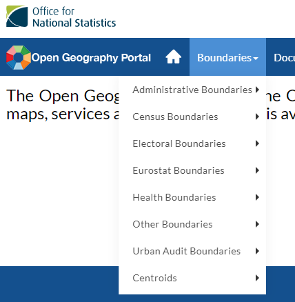
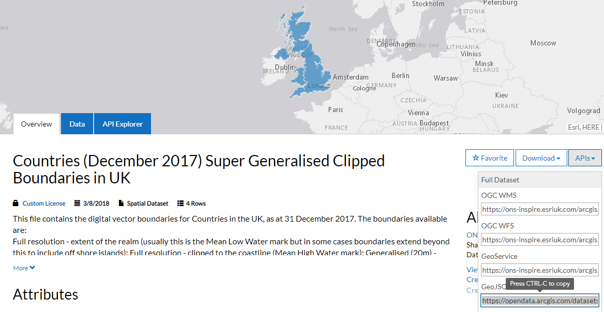
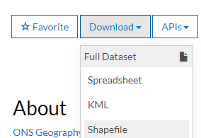

```{r setup, include=FALSE, echo=FALSE, warning =FALSE, message=FALSE}
knitr::opts_chunk$set(echo = TRUE)

#Check if the required packages are installed, if not install them
list.of.packages <- c("leaflet", "leaflet.extras", "DT", "geojsonio", "rgdal", "dplyr")
new.packages <- list.of.packages[!(list.of.packages %in% installed.packages()[,"Package"])]
if(length(new.packages)) install.packages(new.packages)

#Load required packages
library(leaflet)
library(leaflet.extras)
library(DT)
library(geojsonio)
library(dplyr)
```

***
#THIS IS STILL A WORK IN PROGRESS
***

# Chropleth maps

A choropleth map is a thematic map in which areas are shaded or patterned in proportion to the measurement of the statistical variable being displayed on the map, such as population density or per-capita income.  In this exercise we are going to produce the map below.


```{r }
#Insert example of the finished choropleth map we will build
```

## Overview of this exercise

1. Load Boundaries
2. Load a dataset
3. Aggregate the dataset
4. Join the aggregated dataset to the polgyons
5. Visualise
6. Finishing touches

##Load Boundaries

Boundaries are the shapes that make up the areas you wish to visualise.  The boudnaries could be the outline of countries, postcode areas, voting areas or any other geographical boudnary.  Explanation of polygon shape files and where to to get them from.

If your analysis is focused on the UK then the Office of National Statistics (ONS) [Open Geography Portal](http://geoportal.statistics.gov.uk/) is a fantastic resource. It has a wide range of geographies for the UK.  

The [Hierarchical Representation of UK Statistical Geographies](https://geoportal.statistics.gov.uk/datasets/hierarchical-representation-of-uk-statistical-geographies-december-2018) gives a great overview of the geographies available.

You can find the boundaries in the Boundaries menu in the portal.




For this project we are going to use the [English Regions](https://geoportal.statistics.gov.uk/datasets/regions-december-2018-en-buc).  As we are only visualizing the data we will use the Ultra generalised version as it is much smaller in size.

You can download the boundaries as a file or load it directly in r from the ONS website. 

### Load directly from ONS Geography Portal
To load it directly from the ons website you need a GeoJson link.  To get the link click on the API drop down and copy the GeoJSON link.



Here we load the data into a SpatialPolygonDataFrame.  Using the glimpse function on the data slot shows us there are nine polygons, one for each of the English regions.  Each region has a region code stored in the rgn18cd column.

```{r}
#Read the data from the ons website using the link from the site
uk_regions <- geojsonio::geojson_read("https://opendata.arcgis.com/datasets/bafeb380d7e34f04a3cdf1628752d5c3_0.geojson", what = "sp")

#Get glimpse of the data
glimpse(uk_regions@data)

```

If we added these polygons to a map now we would see the nine regions of England.

```{r}
#Create a map and add the polygons
m <- leaflet(uk_regions) %>%
  addPolygons()

#display the map
m
```

***

### Load from downloaded shape file

To download the file, click on the Download menu and select Shapefile.  This will download a zip file containing 6 files.  



Extract the files to a suitbale location.

```{r eval=FALSE}
#read the data using the sf library, from the shp file downloaded from the ONS website
#library(rgdal)

#the dsn is the folder containing the files, the layer is the name of the shape file
#uk_countries2 <- readOGR(dsn="C:/Analysis/R_Studio/Leaflet_examples/polygons", layer =  "Countries_December_2017_Super_Generalised_Clipped_Boundaries_in_Great_Britain")

#Create a map and add the polygons
#m <- leaflet(uk_countries2) %>%
#  addPolygons()

#display the map
#m
```

***

## Load a dataset

For this project we are going to use the Annual data on [Civil Service employment in the UK](https://www.ons.gov.uk/employmentandlabourmarket/peopleinwork/publicsectorpersonnel/datasets/civilservicestatistics).  I have taken the data from table 13 to get the number of permanently employed civil servants in English regions.

```{r }
#Read the csv
civies <- read.csv("data/perm_civil_servants.csv")

#Show the data in a databtable
datatable(civies)
```

We are going to combine this data with the ONS's [estimated population data](https://www.ons.gov.uk/peoplepopulationandcommunity/populationandmigration/populationestimates/datasets/populationestimatesforukenglandandwalesscotlandandnorthernireland) for the regions.  I have  taken the data from table MYE2 and put it in the file pop_est_2017.csv.

We will now load this.

```{r }
#Read the csv
population <- read.csv("data/pop_est_2017.csv")

#Show the data in a databtable
datatable(population)
```

## Join the datasets

We will now join the civies data to the population data.

```{r}
#Join the civies data with the population data
merged <- left_join(x = civies, y = population, by = c("rgn18cd"))

#Display the result
datatable(merged)
```

## Calculate the number of civil servants as a percentage of the population per region
```{r}
#Add a new column 
merged <- mutate(merged, civi_percent = round((total / pop_est_2017)*100, 2))

#Display the result
datatable(merged)
```


## Join the dataset to the polgyons

We can now join the merged dataset onto the data frame stored in the data slot of our SpatialPolygonsDataFrame.

```{r}
#Join the uk_regions@data to the dataset containing population and civil servant values

uk_regions@data <- uk_regions@data %>%   
  left_join(merged, by = c("rgn18cd"))

```

## Visualise

Now we are ready to visualise the data by colouring each polygon.  

We will start by creating a colour pallette using colourbrewer.

```{r}
# Create a continuous palette function
pal <- colorNumeric(palette = "Blues", domain = uk_regions@data$civi_percent)
```


```{r}
#Code to colour the polygons based on the value

m <- leaflet(uk_regions) %>%
  addPolygons(stroke = FALSE, smoothFactor = 0.2, fillOpacity = 1, color = ~pal(civi_percent), highlightOptions = highlightOptions(color = "white", weight = 2, bringToFront = TRUE))
    
#Display the map
m
```

## Finishing touches

Adding legends, 

```{r}
#Adding legends to the map and other finishing touches
```


