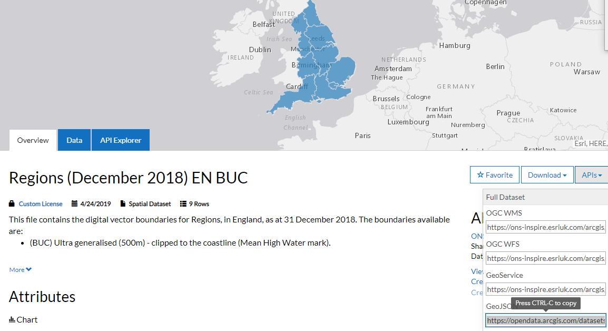

```{r setup, include=FALSE, echo=FALSE, warning =FALSE, message=FALSE}
knitr::opts_chunk$set(echo = TRUE)

#Check if the required packages are installed, if not install them
list.of.packages <- c("leaflet", "leaflet.extras", "DT", "geojsonio", "rgdal")
new.packages <- list.of.packages[!(list.of.packages %in% installed.packages()[,"Package"])]
if(length(new.packages)) install.packages(new.packages)

#Load required packages
library(leaflet)
library(leaflet.extras)
library(DT)
library(geojsonio)
```

# Chropleth maps

A choropleth map is a thematic map in which areas are shaded or patterned in proportion to the measurement of the statistical variable being displayed on the map, such as population density or per-capita income.  In this exercise we are going to produce the map below.


```{r }
#Insert example of the finished choropleth map we will build
```

## Overview of this exercise

1. Load Boundaries
2. Load a dataset
3. Aggregate the dataset
4. Join the aggregated dataset to the polgyons
5. Visualise
6. Finishing touches

##Load Boundaries

Boundaries are the shapes that make up the areas you wish to visualise.  The boudnaries could be the outline of countries, postcode areas, voting areas or any other geographical boudnary.  Explanation of polygon shape files and where to to get them from.

If your analysis is focused on the UK then the Office of National Statistics (ONS) [Open Geography Portal](http://geoportal.statistics.gov.uk/) is a fantastic resource. It has a wide range of geographies for the UK.  

The [Hierarchical Representation of UK Statistical Geographies](https://geoportal.statistics.gov.uk/datasets/hierarchical-representation-of-uk-statistical-geographies-december-2018) gives a great overview of the geographies available.

You can find the boundaries in the Boundaries menu in the portal.


For this project we are going to use the Countries of the UK.  As we are only visualizing the data we will use the [Super Generalised clipped boundaries](https://geoportal.statistics.gov.uk/datasets/countries-december-2017-super-generalised-clipped-boundaries-in-great-britain) as it is much smaller in size which is fine as we are only using it to visualise.

You can download the geography as a file or load it directly in r from the ONS website. 

### Load directly from ONS Geography Portal
To load it directly from the ons website you need a GeoJson link.  To get the link click on the API drop down and copy the GeoJSON link.




```{r}
#Read the data from the ons website using the link from the site
uk_countries <- geojsonio::geojson_read("https://opendata.arcgis.com/datasets/c362832ce5d14728a6fb2b079525be0b_3.geojson", what = "sp")

#Create a map and add the polygons
m <- leaflet(uk_countries) %>%
  addPolygons()

#display the map
m
```

***

### Load from downloaded shape file

To download the file, click on the Download menu and select Shapefile.  This will download a zip file containing 6 files.  


Extract the files to a suitbale location.

```{r eval=FALSE}
#read the data using the sf library, from the shp file downloaded from the ONS website
library(rgdal)

#the dsn is the folder containing the files, the layer is the name of the shape file
uk_countries2 <- readOGR(dsn="C:/Analysis/R_Studio/Leaflet_examples/polygons", layer =  "Countries_December_2017_Super_Generalised_Clipped_Boundaries_in_Great_Britain")

#Create a map and add the polygons
m <- leaflet(uk_countries2) %>%
  addPolygons()

#display the map
m
```

***

## Load a dataset

Explanation of the dataset used in the example

```{r }

#DataTable view to allow the user to explore the dataset
```


## Aggregate the dataset

Aggregating the data to a shapefile level, for example agregating by postcode

```{r}
#Code to aggregate the data
```

## Join the aggregated dataset to the polgyons

Join the aggregated data to the polygon

```{r}
#Code to join the data to the polygon
```

## Visualise

Now we are ready to visualise the data by colouring each polygon.  Info on colourbrewer

```{r}
#Code to colour the polygons based on the value
```

## Finishing touches

Adding legends, 

```{r}
#Adding legends to the map and other finishing touches
```


